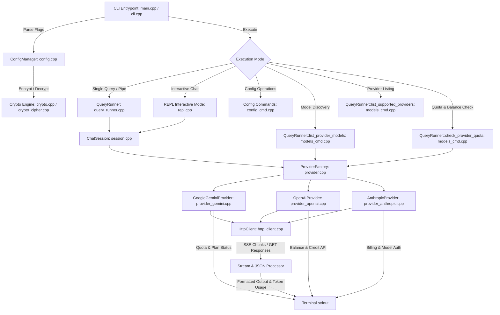

# Architecture Documentation: AI Terminal Client (`ai`)

## Overview
`ai` is a lightweight, dependency-free C++17 command-line tool for interfacing with cloud Large Language Models (LLMs). It provides a unified terminal interface for single queries, shell pipelines, and continuous multi-turn interactive chat sessions across multiple LLM providers, complete with dynamic remote model discovery, bare-flag inspection, persistent system prompts/temperature, and machine-bound encrypted key storage.

## System Architecture

## Module Breakdown

1. **`crypto.hpp` / `crypto.cpp` / `crypto_cipher.cpp`**: Hardware/user-bound key derivation, SHA-256, Base64, and stream cipher for encrypted API key storage (`enc:v1:...`) with zero external crypto package dependencies.
2. **`types.hpp`**: Common data structures (`ChatMessage`, `Role`, `RequestOptions`, `HttpResponse`, `UsageInfo`, `QuotaInfo`, `StreamCallback`, `UsageCallback`).
3. **`json.hpp` / `json_dump.cpp` / `json_parse.cpp`**: Zero-dependency RFC 8259 JSON parser and serializer with clean C++ interface.
4. **`utils.hpp` / `utils.cpp`**: Path resolution, home directory detection, secure file permissions (0600), string trimming, environment variable lookups.
5. **`config.hpp` / `config.cpp`**: Encrypted configuration loading and persistence to `~/.config/ai/config.json`, storing default provider, models, API keys, system prompt, and temperature.
6. **`session.hpp` / `session.cpp`**: Conversation history state management, message appending, context trimming.
7. **`http_client.hpp` / `http_client.cpp`**: Libcurl abstraction supporting GET, POST, and real-time SSE streaming callbacks.
8. **`provider.hpp` / `provider.cpp`**: Base interface `LLMProvider` defining methods for payload generation, streaming, usage extraction (`extract_usage`), model listing (`list_models`), quota/balance checking (`check_quota`), and factory creation.
9. **`provider_gemini.hpp` / `provider_gemini.cpp`**: Google Gemini REST API implementation (`streamGenerateContent`, `generateContent`, `models` listing, rate-limit quota check).
10. **`provider_openai.hpp` / `provider_openai.cpp`**: OpenAI / OpenAI-compatible REST API implementation (Groq, DeepSeek, OpenRouter, Ollama, custom endpoints, `/user/balance` queries, `/api/v1/credits` queries).
11. **`provider_anthropic.hpp` / `provider_anthropic.cpp`**: Anthropic Claude REST API implementation (`messages`, `models` listing, token usage decoders, billing dashboard links).
12. **`terminal.hpp` / `terminal.cpp`**: ANSI color formatting, TTY detection, banner display, token usage reporting (`print_usage`), and account balance/quota formatting (`print_quota`).
13. **`cli.hpp` / `cli.cpp`**: Command-line flag parsing with bare flag support (`ai -p`, `ai -m`, `ai -s`, `ai -t`, `ai -u`, `ai -q`, `ai --quota [provider]`, `ai --balance all`).
14. **`repl.hpp` / `repl.cpp`**: Interactive prompt loop, multiline input, in-chat slash commands (`/clear`, `/models`, `/model`, `/provider`, `/system`, `/usage`, `/quota`, `/balance`, `/help`, `/history`, `quit`).
15. **`query_runner.hpp` / `query_runner.cpp`**: Single query execution inheriting persistent defaults and handling streaming/usage reporting.
16. **`config_cmd.cpp`**: Config setting, listing, deletion, system prompt and temperature inspection.
17. **`models_cmd.cpp`**: Remote model listing, supported provider catalog, and multi-provider quota/balance checks (`QueryRunner::check_provider_quota`).
18. **`main.cpp`**: Entry point orchestrating CLI parsing and mode dispatch.
